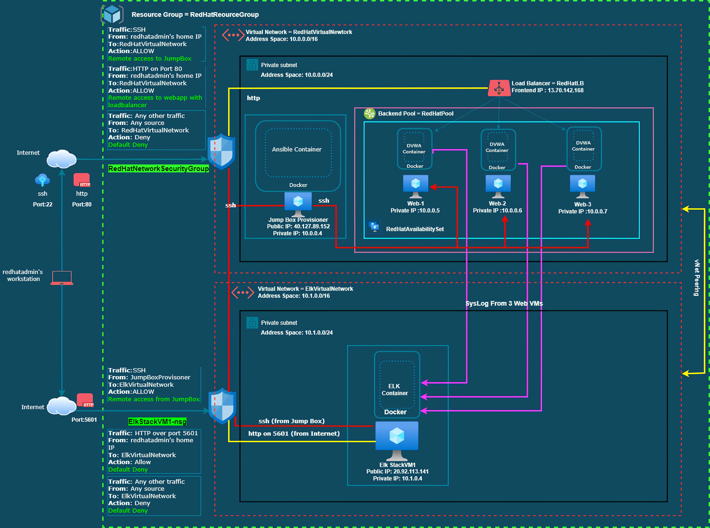
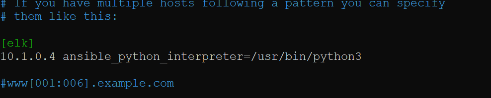

## Automated ELK Stack Deployment

The files in this repository were used to configure the network depicted below.

These files have been tested and used to generate a live ELK deployment on Azure. They can be used to either recreate the entire deployment pictured above. Alternatively, select portions of the playbook file may be used to install only certain pieces of it, such as Filebeat.

  - [hosts.txt](Ansible/hosts.txt)
  - [ansible_cfg.txt](Ansbile/ansible_cfg.txt)
  - [pentest.yml](Ansible/pentest.yml)
  - [install-elk.yml](Ansible/install-elk.yml)
  - [filebeat-config.yml](Ansible/filebeat-config.yml)
  - [filebeat-playbook.yml](Ansible/filebeat-playbook.yml)
  - [metricbeat-config.yml](Ansible/metricbeat-config.yml)
  - [metricbeat-playbook.yml](Ansible/metricbeat-playbook.yml)

This document contains the following details:
 - Description of the Topology
 - Access Policies
 - DVWA Configuration
 - ELK Configuration
   - Beats in Use
   - Machines Being Monitored
 - How to Use the Ansible Build

### Description of the Topology

The main purpose of this network is to expose a load-balanced and monitored instance of DVWA, the D*mn Vulnerable Web Application.

Load balancing ensures that the application will be highly available, in addition to restricting access to the network.
- _Load Balancers protect the availability aspect of the security. Jump box acts as a gateway to other resources in the network that are not exposed to the internet and hence, used to manage and access other resources securely. Usually, jump box is a hardened and monitored device_.

Integrating an ELK server allows users to easily monitor the vulnerable VMs for changes to the metrics and system logs.
- _Filebeat watches for the log events_.
- _Metricbeat watches for metrics from operating system and running services._

The configuration details of each machine may be found below.

| Name               | Function                        | IP Address | Operating System     |
|--------------------|---------------------------------|------------|----------------------|
| JumpBoxProvisioner | Gateway                         | 10.0.0.4   | Linux(Ubuntu 18.04)  |
| Web-1              | Vulnerable Webserver 1(DVWA)    | 10.0.0.5   | Linux(Ubuntu 18.04)  |
| Web-2              | Vulnerable Webserver 2(DVWA)    | 10.0.0.6   | Linux(Ubuntu 18.04)  |
| Web-3              | Vulnerable Webserver 3(DVWA)    | 10.0.0.7   | Linux(Ubuntu 18.04)  |
| ElkStackVM1        | System Monitoring and Analytics | 10.1.0.4   | Linux(Ubuntu 18.04)  |

### Access Policies

The machines on the internal network are not exposed to the public Internet. 

Only the JumpBoxProvisioner machine can accept connections from the Internet. Access to this machine is only allowed from the redhatadmin's public IP addresses,which is as follows:
- _124.168.195.197_

Machines within the network can only be accessed by JumpBoxProvisioner.
- _ELK VM can be accessed from JumpBoxProvisioner. IP Address of JumpBoxProvisioner is 10.0.0.4._ 

A summary of the access policies in place can be found in the table below.
| Name               | Publicly Accessible | Allowed IP Addresses |
|--------------------|---------------------|----------------------|
| JumpBoxProvisioner | Yes(Port 22)        | 124.168.195.197      |
| Web-1              | No                  | 10.0.0.4             |
| Web-2              | No                  | 10.0.0.4             |
| Web-3              | No                  | 10.0.0.4             |
| ElkStackVM1        | Yes(Port 5601)      | 124.168.195.197      |
| ElkStackVM1        | No                  | 10.0.0.4             |

### DVWA Configuration

Ansible was used to automate configuration of the vulnerable webservers. No configuration was performed manually, which is advantageous because ansible uses
playbooks to setup and update conifgurations in multiple host machines easily and quickly. It also ensures that all three webservers have same configuration. The playbook used for DVWA configuration was [pentest.yml](Ansible/pentest.yml). 

The playbook implements the following tasks on all three webservers:
- _Install the docker._
- _Install python package manager: pip3._
- _Install python docker module._
- _Download the image and launch vulnerable webserver container._
- _Ensure VM always starts with docker service enabled._

The following screenshot displays the result of running `docker ps` after successfully configuring vulnerable webserver container. The output is obtained from vulnerable webserver Web-1 but output from other two servers should be similar.

### Elk Configuration

Ansible was used to automate configuration of the ELK machine. No configuration was performed manually, which is advantageous because ansible uses
playbooks to setup and update conifgurations in multiple host machines easily and quickly. Playbooks are easy to read, write and understand.The playbook used for Elk configuration was [install-elk.yml](Ansible/install-elk.yml).

The playbook implements the following tasks on ElkStackVM1:
- _Install the docker._
- _Install python package manager: pip3._
- _Set the memory map area for the VM._
- _Install python docker module._
- _Download and launch the ELK Stack image and map corresponding ports._
- _Ensure VM always starts with docker service enabled._

The following screenshot displays the result of running `docker ps` after successfully configuring the ELK instance.

### Target Machines & Beats
This ELK server is configured to monitor the following machines:
- _10.0.0.5 (Web-1)_
- _10.0.0.6 (Web-2)_
- _10.0.0.7 (Web-3)_

We have installed the following Beats on these machines:
- _Filebeat_
- _Elasticbeat_

These Beats allow us to collect the following information from each machine:
- _Filebeat monitors the log files and collects log events from the host.
  In this project,Filebeat collects and parse logs written by local syslog server of the webservers. For example, we can track the ssh login attempts in the webservers. The following screenshot displays the successful ssh login in the webserver Web-2 from Kibana portal._

  

- _Metricbeat monitors the server and the services they host and collect their metrics._
  _In this project, Metricbeat gathers the metrics from the docker container dvwa(d*mn vuulnerable web application)._
  _For example, we can track the cpu usage of the dvwa docket container. The following screenshot displays the cpu usage of dvwa container from the Kibana portal._

   

### Using the Playbook
In order to use the playbook, you will need to have an Ansible control node already configured.In this project, control node is the **JumpBoxProvisioner VM**.Assuming you have such a control node provisioned: 

SSH into the control node and follow the steps below:

#### Playbook to configure DVWA

- _Copy the pentest.yml file to /etc/ansible/._
- _Update the /etc/ansible/hosts file to include the ip addresses of vulnerable webservers(Web-1,Web-2,Web-3)_
  - _Add ip address of three vulnerable webservers under [webservers] hosts in hosts file._

  
- _Run the playbook, and navigate to http://13.70.142.168/setup.php to check that the installation worked as expected as shown in the image below.
  (where 13.70.142.168 is frontend ip of load balancer which has Web-1,Web-2,Web-3 vulnerable webservers in its backend pool.)_

  

#### Playbook to configure Elk Stack

- _Copy the install-elk.yml file to /etc/ansible/._
- _Update the /etc/ansible/hosts file to include the ip address of elk stack VM (ElkStackVM1)_
  - _Add ip address of ElkStackVM1 under [elk] hosts in hosts file (we added the ip address of all three vulnerable web servers under [webserver] hosts)._

  
- _Run the playbook, and navigate to http://20.92.113.141:5601/app/kibana to check that the installation worked as expected as shown in the image below.
  (where 20.92.113.141 is the public facing ip of ElkStackVM1 and 5601 is the port over which Kibana, frontend portal of ELK stack is accessible)._

  
  
#### Playbook to steup filebeat on vulnerable webservers

- _Copy the filebeat-config.yml file to /etc/ansible/file/._
- _Copy the filebeat-playbook.yml file to /etc/ansible/roles/._
- _The /etc/ansible/hosts file already includes the ip address vulnerable webservers(Web-1,Web-2,Web-3)_
- _Run the playbook [filebeat-playbook.yml](Ansible/filebeat-playbook.yml) , and navigate to http://20.92.113.141:5601/app/kibana#/home/tutorial/systemLogs and under **DEB** section, click **Check Data** for **Module Status**.The successful installation should display the following output._

  

  _This indicates that Elk Stack is successfully receiving data from Filebeat system module from three vulnerable webservers._
- _Click on **System logs dashboard** to explore system log data from three vulnerable webservers.The screenshot below shows the syslog dashboard in Kibana._

  

#### Playbook to steup metricbeat on vulnerable webservers

- _Copy the metricbeat-config.yml file to /etc/ansible/file/._
- _Copy the metricbeat-playbook.yml file to /etc/ansible/roles/._
- _The /etc/ansible/hosts file already includes the ip address vulnerable webservers(Web-1,Web-2,Web-3)_
- _Run the playbook [metricbeat-playbook.yml](Ansible/metricbeat-playbook.yml) , and navigate to http://20.92.113.141:5601/app/kibana#/home/tutorial/dockerMetrics and under **DEB** section, click **Check Data** for **Module Status**.The successful installation should display the following output._
  
  
  
  _This indicates that Elk Stack is successfully receiving data from Metricbeat docker module from three vulnerable webservers._
- _Click on **Docker metric dashboard** to explore docker metrics data from three vulnerable webservers._

  

### Commands used

#### To generate ssh key

- `ssh-keygen` 

#### To ssh JumpBoxProvisioner

- `ssh redhatadmin@40.127.89.152`

#### Ensure the control node can reach all hosts listed on ansible hosts file

- `ansible all -m ping`

#### To list available containers

- `sudo docker container list -a`

#### To start and connect to the ansible container named eloquent_matsumoto

- `sudo dcoker container start eloquent_matsumoto`
- `sudo docker container attach eloquent_matsumoto`

#### To edit ansible hosts and configuration file

- `nano /etc/ansible/hosts`
- `nano /etc/ansible/ansible.cfg`

#### To run the ansible playbooks

- `ansible-playbook /etc/ansible/pentest.yml`
- `ansible-playbook /etc/ansible/instal-elk.yml`
- `ansible-playbook /etc/ansible/files/filebeat-playbook.yml`
- `ansible-playbook /etc/ansible/files/metricbeat-playbook.yml`

